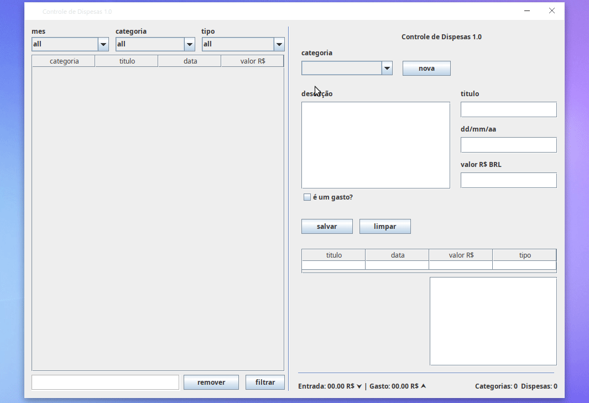

# ExpenGui

  

  
  
  

  #### Descrição
  **ExpenGui** é um simples gerenciador de tarefas desenvolvido em Java, utilizando os princípios de encapsulamento da disciplina de Programação Orientada a Objetos (POO). O projeto foi criado com o intuito de exercitar o uso do encapsulamento, e permite gerenciar despesas, filtrando por mês, categoria e tipo (gasto ou entrada). Além disso, é possível adicionar, editar, remover e visualizar despesas, bem como adicionar novas categorias.

  O foco do projeto não era a persistência de dados, nem a interface gráfica em si, por isso os dados não são persistidos entre execuções. O projeto foi desenvolvido com Java Swing para criar a interface gráfica, e as principais classes incluem:
  
  - **Expense**: Representa uma despesa.
  - **Categorie**: Contém uma lista de despesas e categoriza os gastos.

  #### Tarefas

  - [x] Adicionar despesas
  - [x] Filtrar despesas por mês, categoria e tipo
  - [x] Adicionar novas categorias
  - [x] CRUD completo para despesas
  - [x] Interface gráfica com Swing

  #### Links para download

  - [Download .jar](ExpenGui.jar)
  - [Download NetBeans Project (.zip)](PRJ_ExpenGui.zip)

  

