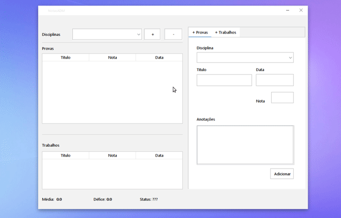

# Sistema de Gerenciamento de Notas

  

  
  
  

  ##### Descrição
  **Sistema de Gerenciamento de Notas** é um projeto desenvolvido em Java para a disciplina de Programação Orientada a Objetos (POO). O sistema permite que os estudantes gerenciem suas notas de provas e trabalhos de diversas matérias, com foco no uso de **herança de classes**.

  O sistema permite:
  - Criar disciplinas
  - Adicionar provas e trabalhos em cada disciplina
  - Remover disciplinas, provas e trabalhos
  - Calcular automaticamente a média do aluno em uma matéria
  - Identificar quantos pontos faltam para o aluno ser aprovado

  O projeto não permite modificar avaliações após o cadastro. Todos os dados são gerenciados em memória, sem persistência.

  ##### Implementação
  O projeto usa **herança** para organizar as avaliações em três classes principais:
  - **Avaliacoes**: Classe pai que contém os atributos e métodos comuns a todas as avaliações.
  - **Provas**: Classe filha de Avaliacoes, específica para provas.
  - **Trabalhos**: Classe filha de Avaliacoes, específica para trabalhos.

  Além disso, a classe **Disciplinas** contém um array que armazena objetos de **Provas** e **Trabalhos**, permitindo ao estudante visualizar e gerenciar suas notas em cada disciplina.

  ##### Tarefas

  - [x] Criar disciplinas
  - [x] Adicionar provas e trabalhos
  - [x] Calcular média do aluno
  - [x] Identificar quantos pontos o aluno precisa para passar
  - [x] Remover disciplinas, provas e trabalhos
  - [x] Interface gráfica em Swing

  ##### Links para download

  - [Download](notas_dist.jar)
  - [Download NetBeans Project](PRJ__NotasAdm.zip)

  

