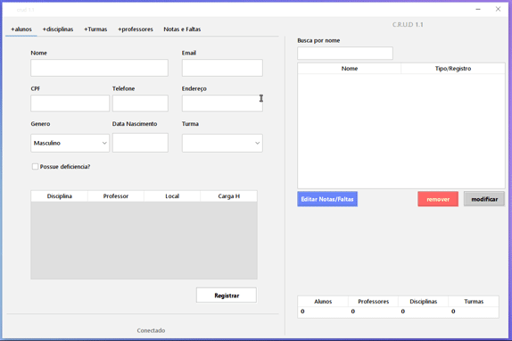

# Sistema Escolar - CRUD

  

  
  
  

  #### Descrição
  **Sistema Escolar CRUD** é um sistema desenvolvido em Java que permite o gerenciamento de disciplinas, alunos, professores e turmas em uma escola. O projeto foi desenvolvido para exercitar os conceitos de banco de dados e encapsulamento, com funcionalidades que incluem:

  - Cadastro de disciplinas, alunos, professores e turmas.
  - Atribuição automática de alunos às disciplinas com base na turma.
  - Verificação de conflitos de horários entre disciplinas.
  - Lançamento de notas e faltas.

  O sistema foi criado utilizando **Java Swing** para a interface gráfica e **MySQL** para a persistência dos dados. Ele automatiza a atribuição de alunos às disciplinas, otimizando a alocação de turmas, e oferece uma interface intuitiva com abas para facilitar a navegação entre as funcionalidades.

  - **Disciplinas**: Cadastro de disciplinas com verificação de conflitos de horário.
  - **Professores**: Cadastro de professores e atribuição de disciplinas.
  - **Alunos**: Atribuição automática de alunos às disciplinas cadastradas.
  - **Turmas**: Gerenciamento de turmas e disciplinas atribuídas.

  #### Tarefas

  - [x] Cadastro de disciplinas, alunos, professores e turmas
  - [x] Atribuição automática de alunos às disciplinas
  - [x] Verificação de conflitos de horário
  - [x] Lançamento de notas e faltas
  - [x] Interface gráfica em Swing

  #### Links para download

  - [Download .jar](crud_dist.zip)
  - [Download NetBeans Project (.zip)](crud)

  

