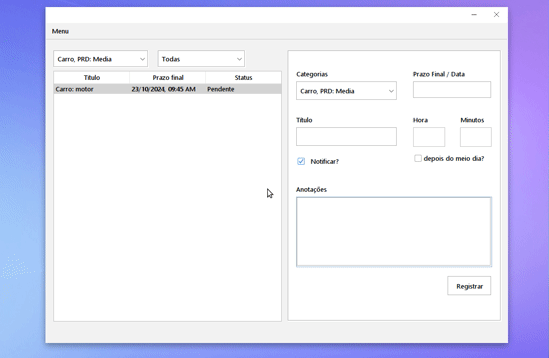

# PRJ__TasksAdm - Gerenciador de Tarefas

  

  
  
  

  #### Descrição
  **PRJ__TasksAdm** é um sistema desenvolvido em Java para gerenciar tarefas e foi criado para a disciplina de Programação Orientada a Objetos (POO). O projeto foca em aplicar conceitos de **herança**, **polimorfismo**, **encapsulamento**, e **interface gráfica com Swing**.

  O sistema permite:
  - **Agendar tarefas** com data e horário específicos.
  - **Criar, remover e atualizar tarefas**.
  - **Adicionar, remover e editar categorias**.
  - **Sistema de alerta** que notifica o usuário sobre tarefas pendentes, com a opção de marcar como concluída ou não.

  Este projeto não persiste os dados entre execuções, sendo gerenciado inteiramente em memória. O objetivo principal é exercitar a criação de classes base, uso de herança e polimorfismo, e encapsular a lógica de tarefas e categorias.

  #### Implementação
  O projeto é estruturado com os seguintes conceitos:
  - **Herança**: Classes base para Tarefas, com subclasses específicas para diferentes tipos de tarefas.
  - **Polimorfismo**: Métodos que tratam diferentes tipos de tarefas de forma uniforme.
  - **Encapsulamento**: Controle de acesso aos atributos e métodos para garantir a integridade dos dados.
  - **Swing**: Interface gráfica que permite ao usuário interagir facilmente com o sistema.

  #### Tarefas

  - [x] Agendar tarefas com data e horário
  - [x] Criar, remover e atualizar tarefas
  - [x] Adicionar, remover e editar categorias
  - [x] Sistema de alerta para notificação de tarefas
  - [x] Interface gráfica com Swing

  #### Links para download

  - [Download .jar](PRJ__TasksAdm_jar.zip)
  - [Download NetBeans Project (.zip)](PRJ_TasksAdm.zip)

  

